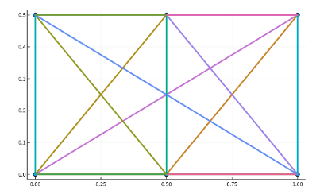
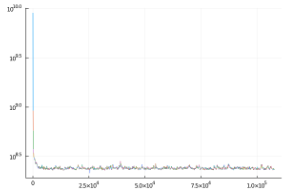
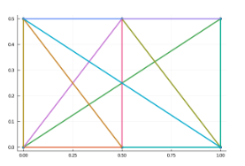
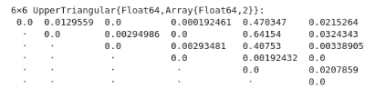

# Truss-optimization
Library implementing Genetic algorithm to find optimal truss structure.

##  Introduction
A truss is an assemblage of long, slender structural elements or beams that are connected at theirends to create a firm structure.
Trusses and substantial use in modern construction, for instance as towers, bridges, scaffolding, robots, etc.

## Results:
This is the initial truss:

After performing the GA optimization algorithm, we get the following figures:

- Evolution of the energy of deformation:
  

- Final truss structure:
  

- Cross sectional area matrix:
  
